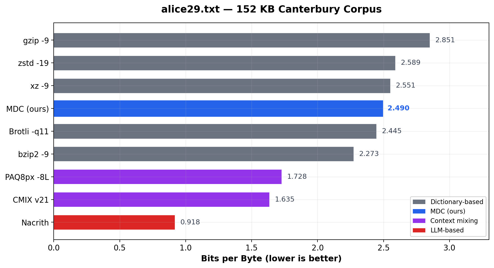
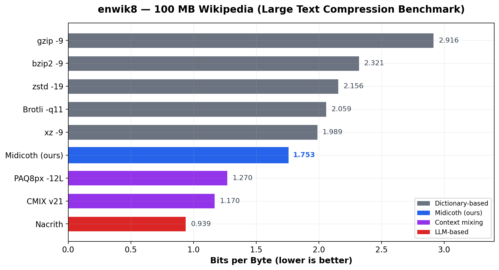
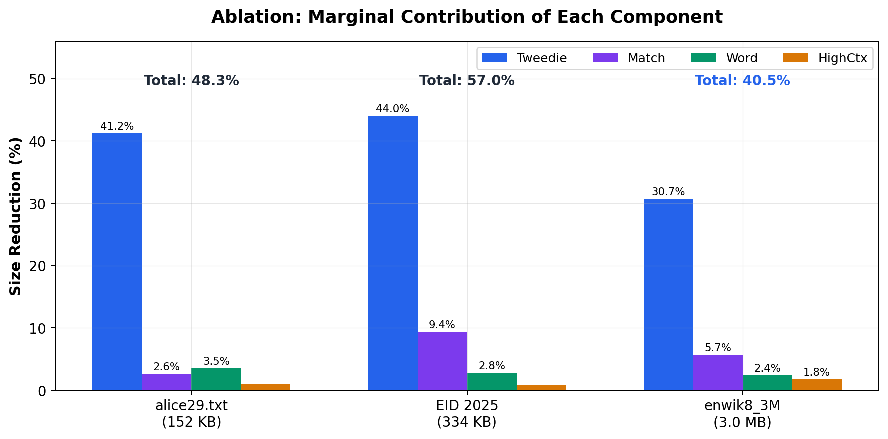
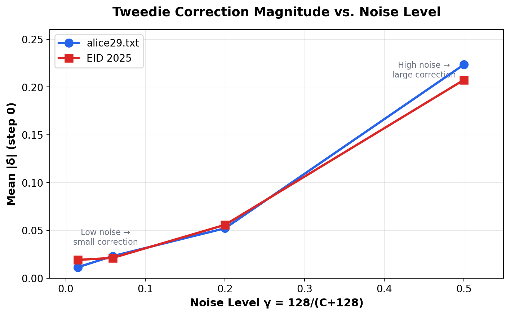

# Midicoth (MDC) — Micro-Diffusion Compression

**Lossless data compression via Binary Tree Tweedie Denoising**

[](LICENSE)

Midicoth is a lossless text compressor that introduces *micro-diffusion* — a multi-step score-based reverse diffusion process inspired by Tweedie's empirical Bayes formula — into a cascaded statistical modeling pipeline. It treats a PPM model's Jeffreys-prior smoothing as a forward noise process and reverses it through binary tree denoising, achieving compression ratios that outperform xz, zstd, Brotli, and gzip on all tested inputs.

**No neural network. No training data. No GPU. ~2,000 lines of C.**

---

## Results

### alice29.txt — 152 KB (Canterbury Corpus)



### enwik8 — 100 MB (Large Text Compression Benchmark)



| Benchmark | MDC | xz -9 | Improvement |
|-----------|-----|--------|-------------|
| **alice29.txt** (152 KB) | **2.490 bpb** | 2.551 bpb | **2.4%** |
| **enwik8** (100 MB) | **1.831 bpb** | 1.989 bpb | **8.0%** |
| **EID 2025** (334 KB) | **1.744 bpb** | 1.739 bpb | ~equal |

MDC outperforms all dictionary-based compressors (gzip, zstd, xz, Brotli) on enwik8 and alice29.txt, narrowing the gap to heavyweight context-mixing systems like PAQ and CMIX.

---

## How It Works

MDC processes input one byte at a time through a five-layer cascade:

```
Input byte stream
    |
    v
[1] PPM Model (orders 0-4, Jeffreys prior)
    |  produces 256-way probability distribution + confidence
    v
[2] Tweedie Denoiser (binary tree, K=3 steps)
    |  decomposes into 8 binary decisions (MSB→LSB)
    |  applies additive correction δ ≈ σ²·s(p̂) at each node
    v
[3] Match Model (context lengths 4-16)
    |  detects long-range byte repetitions
    v
[4] Word Model (trie + bigram)
    |  word completion and next-word prediction
    v
[5] High-Order Context (orders 5-8)
    |  extends context beyond PPM's order-4 limit
    v
Arithmetic Coder → compressed output
```

### The Key Idea: Tweedie Denoising

PPM models smooth their predictions with a Jeffreys prior (0.5 per symbol, 128 total pseudo-counts). When few observations are available, this prior dominates — pulling the distribution toward uniform and wasting bits. We frame this as a **denoising problem**:

- **Forward noise**: The Jeffreys prior acts as a convex mixture toward uniform: `p̂ = λq + (1-λ)u`, where `γ = 128/(C+128)` is the noise fraction
- **Reverse diffusion**: Calibration tables estimate the additive Tweedie correction `δ̂ = E[θ|p̂] - E[p̂]`, which approximates `σ²·s(p̂)` (the Tweedie score term)
- **Binary tree**: Each 256-way prediction is decomposed into 8 binary decisions, enabling data-efficient calibration
- **Multi-step**: K=3 denoising steps with independent score tables, each correcting residual noise from the previous step

### Ablation: Component Contributions



The Tweedie denoiser alone accounts for **31–44%** of the total compression improvement — the single most impactful component. The full pipeline achieves **40–57%** improvement over base PPM across all datasets.

### Empirical Validation of the Diffusion Interpretation



The correction magnitude |δ̂| scales monotonically with the noise level γ, consistent with Tweedie's formula: high noise (small observation count) requires large corrections; low noise requires small corrections. This pattern is consistent across different files and genres.

---

## Quick Start

### Build

```bash
make
```

This compiles two binaries:
- `mdc` — the compressor/decompressor
- `ablation` — the ablation study tool

Requirements: GCC (or any C99 compiler) and `libm`. No other dependencies.

### Compress

```bash
./mdc compress input.txt output.mdc
```

### Decompress

```bash
./mdc decompress output.mdc restored.txt
```

### Verify round-trip

```bash
./mdc compress alice29.txt alice29.mdc
./mdc decompress alice29.mdc alice29.restored
diff alice29.txt alice29.restored  # should produce no output
```

### Run ablation study

```bash
./ablation alice29.txt
```

This runs five configurations (Base PPM, +Tweedie, +Match, +Word, +HighCtx) and reports the marginal contribution of each component with round-trip verification.

---

## Architecture

### File Structure

| File | Description |
|------|-------------|
| `mdc.c` | Main compressor/decompressor driver |
| `ppm.h` | Adaptive PPM model (orders 0–4) with Jeffreys prior |
| `tweedie.h` | Binary tree Tweedie denoiser (K=3 steps, 155K calibration entries) |
| `match.h` | Extended match model (context lengths 4, 6, 8, 12, 16) |
| `word.h` | Trie-based word model with bigram prediction |
| `highctx.h` | High-order context model (orders 5–8) |
| `arith.h` | 32-bit arithmetic coder (E1/E2/E3 renormalization) |
| `fastmath.h` | Fast math utilities (log, exp approximations) |
| `ablation.c` | Ablation study driver |
| `delta_vs_noise.c` | Experiment: |δ̂| vs noise level γ |
| `Makefile` | Build system |

### Design Principles

- **Header-only modules**: Each component is a self-contained `.h` file with `static inline` functions. No separate compilation units needed.
- **Zero external dependencies**: Only `libm` is required. No GPU, no pre-trained models.
- **Fully online**: All models are adaptive — no pre-training or offline parameter estimation.
- **Deterministic**: Bit-exact encoder–decoder symmetry. Compress on one machine, decompress on another — identical output guaranteed.
- **Count-based**: All learnable components use simple count accumulation, avoiding the overfitting risk of gradient-based learners in the online setting.

### Calibration Table Structure

The Tweedie denoiser maintains a 6-dimensional calibration table:

```
table[step][bit_context][order_group][shape][confidence][prob_bin]
       3   ×    27     ×     3      ×  4   ×     8     ×   20
                    = 155,520 entries (~3.6 MB)
```

Each entry tracks three sufficient statistics:
- `sum_pred`: sum of predicted P(right) values
- `hits`: count of times the true symbol went right
- `total`: total observations

The Tweedie correction is: `δ = hits/total - sum_pred/total`

The **confidence** dimension serves as noise-level conditioning (analogous to the time step in DDPM): contexts with few observations have high noise `γ ≈ 1` and require large corrections; contexts with many observations have low noise `γ ≈ 0` and require small corrections.

---

## Compressed Format

MDC files use the `.mdc` extension with a simple format:

| Offset | Size | Content |
|--------|------|---------|
| 0 | 4 bytes | Magic: `MDC7` |
| 4 | 8 bytes | Original file size (uint64, little-endian) |
| 12 | variable | Arithmetic-coded bitstream |

The format is self-contained — no external dictionaries or model files needed. The decompressor reconstructs the identical model state from the compressed stream.

---

## Performance

| File | Size | Ratio | Speed | bpb |
|------|------|-------|-------|-----|
| alice29.txt | 152 KB | 31.1% | ~54 KB/s | 2.490 |
| EID 2025 | 334 KB | 21.8% | ~60 KB/s | 1.744 |
| enwik8_3M | 3.0 MB | 27.9% | ~60 KB/s | 2.232 |
| enwik8 | 100 MB | 22.9% | ~78 KB/s | 1.831 |

All measurements on a single CPU core (x86-64). Speed is consistent across input sizes. Compression ratio improves with larger inputs as adaptive models accumulate more observations.

### Comparison with Other Approaches

| Category | Example | enwik8 bpb | Requires |
|----------|---------|------------|----------|
| Dictionary-based | xz -9 | 1.989 | CPU |
| **MDC (this work)** | **—** | **1.831** | **CPU** |
| Context mixing | PAQ8px | ~1.27 | CPU (hours) |
| Context mixing | CMIX v21 | ~1.17 | CPU (16-64 GB RAM) |
| LLM-based | Nacrith | 0.939 | GPU + pre-trained model |

MDC occupies a unique position: better than all dictionary compressors, simpler and faster than context mixers, and fully online without any pre-trained knowledge.

---

## Paper

The full technical details, theoretical framework, and comprehensive experimental results are described in:

> **Micro-Diffusion Compression: Binary Tree Tweedie Denoising for Online Probability Estimation**
> Roberto Tacconelli, 2025

Key references:
- Efron, B. (2011). *Tweedie's formula and selection bias.* JASA, 106(496):1602–1614. [doi:10.1198/jasa.2011.tm11181](https://doi.org/10.1198/jasa.2011.tm11181)
- Ho, J., Jain, A., Abbeel, P. (2020). *Denoising diffusion probabilistic models.* NeurIPS 2020.
- Cleary, J.G. and Witten, I.H. (1984). *Data compression using adaptive coding and partial string matching.* IEEE Trans. Comm., 32(4):396–402.

---

## Test Data

- **alice29.txt** (152,089 bytes): Canterbury Corpus — Lewis Carroll's *Alice's Adventures in Wonderland*. Included in this repository.
- **enwik8** (100,000,000 bytes): First 100 MB of English Wikipedia. Download from the [Large Text Compression Benchmark](http://mattmahoney.net/dc/text.html).
- **English Indices of Deprivation 2025** (333,794 bytes): UK government report published October 2025. Used as out-of-distribution test data — published after the training cutoff of all evaluated neural/LLM-based compressors, ensuring no model has seen this text during training.

---

## Building from Source

### Prerequisites

- A C99 compiler (GCC, Clang, or MSVC)
- `make` (optional — you can compile directly)

### Using Make

```bash
make          # builds mdc and ablation
make clean    # removes binaries
```

### Manual compilation

```bash
gcc -O3 -march=native -o mdc mdc.c -lm
gcc -O3 -march=native -o ablation ablation.c -lm
```

### Additional tools

```bash
# Delta vs noise experiment (validates diffusion interpretation)
gcc -O3 -march=native -o delta_vs_noise delta_vs_noise.c -lm
./delta_vs_noise alice29.txt
```

---

## License

This project is licensed under the Apache License 2.0 — see the [LICENSE](LICENSE) file for details.

```
Copyright 2025 Roberto Tacconelli
```

---

## Citation

If you use MDC in your research, please cite:

```bibtex
@article{tacconelli2025mdc,
  title={Micro-Diffusion Compression: Binary Tree Tweedie Denoising
         for Online Probability Estimation},
  author={Tacconelli, Roberto},
  year={2025}
}
```

## Related Work

- [Nacrith](https://github.com/robtacconelli/Nacrith-GPU) — LLM-based lossless compression (0.939 bpb on enwik8)
- [PAQ8px](https://github.com/hxim/paq8px) — Context-mixing compressor
- [CMIX](http://www.byronknoll.com/cmix.html) — Context-mixing with LSTM
- [Large Text Compression Benchmark](http://mattmahoney.net/dc/text.html) — enwik8 benchmark
